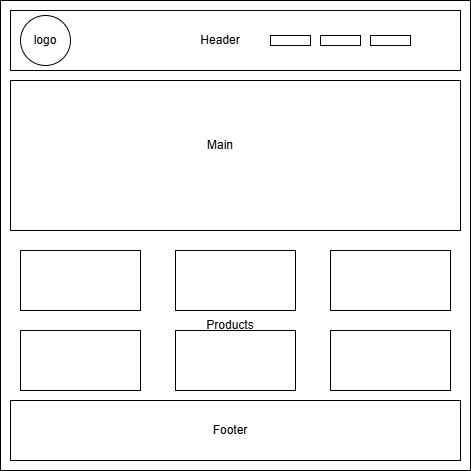

# Mano de Tigre ☕🐅

**Para cuando una mano de gato no basta...**

---

## 🧾 Descripción General

**Mano de Tigre** es una landing page desarrollada como parte del Proyecto 3: Landing de Negocio.

Está diseñada para promocionar y vender productos e insumos para cafeterías y amantes del café, tales como mugs, molinillos, cafeteras, granos, kits de barista, entre otros.

La interfaz está orientada al usuario, con un diseño atractivo, responsivo y cálido, basado en tonalidades pastel que evocan la temática del café.

---

## 📐 Estructura del sitio

El sitio se divide en las siguientes secciones:

- **Header**: Incluye el logo, nombre del negocio, menú de navegación y formulario de suscripción.
- **Main**: Área destacada con fondo animado de imágenes y mensaje comercial.
- **Products**: Sección que muestra los productos disponibles con efecto hover (aumento suave al pasar el cursor).
- **Footer**: Información de contacto y redes sociales.

A continuación, se presenta el prototipado de la estructura del sitio:



---

## 🛠️ Tecnologías utilizadas

- **HTML5**
- **TailwindCSS**
- **Google Fonts** (tipografía personalizada tipo “Pacifico”)
- **Animaciones CSS** (`@keyframes` para fondo animado)
- **Responsive Design** (adaptación móvil con Tailwind)

---

## 📂 Archivos incluidos

- `index.html`: código fuente del sitio con animación de fondo, efectos de hover, productos, diseño responsivo.
- `Prototipado.drawio.png`: imagen de referencia con la estructura visual planificada.
- Carpeta `/assets`: contiene logo, fondos y productos.

---

## 🚀 Cómo visualizar el sitio

1. Asegúrate de tener una estructura de carpetas como esta:

```
/proyecto
├── index.html
├── README.md
├── Prototipado.drawio.png
└── /assets
    ├── logo.png
    ├── bg1.jpg
    ├── bg2.jpg
    ├── bg3.jpg
    ├── mug.jpg
    ├── molinillo.jpg
    ├── cafetera.jpg
    ├── granos.jpg
    ├── vasos.jpg
    └── kit.jpg
```

2. Abre `index.html` con cualquier navegador moderno.


---

## 📧 Contacto

Desarrollado por Jonathan Mattisine O. 
Correo: mattisine.jonathan@gmail.com  

